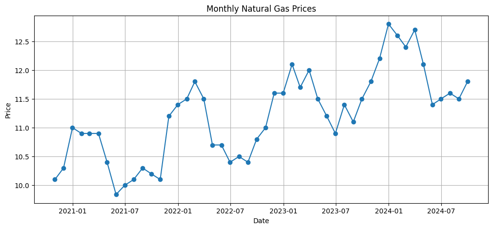

# 📈 Natural Gas Price Interpolation and Forecasting

This project estimates daily natural gas prices from monthly market data and produces a 12 month price forecast. It includes a Python function that returns an estimated gas price for any past date or future date based on interpolation, extrapolation and seasonality trends.

This simulation is inspired by a quantitative research task for a commodity trading desk, focusing on data cleaning, time series analysis, and predictive modeling.

## 🔍 Project Overview

Natural gas storage contracts require accurate price estimates for injection and withdrawal dates.
The raw data consists of monthly, end of month gas prices from October 2020 to September 2024.

This project:

1. Cleans and loads the CSV data

2. Interpolates prices to generate daily estimates

3. Identifies seasonal patterns

4. Produces a future 12 month extrapolation

5. Implements a price_on_date() function to query any date

6. Visualizes historical and predicted price

## 📁 Files in this Repository

### Project Files

- [📄 Nat_Gas data jpmorgan.csv](Nat_Gas%20data%20jpmorgan.csv)  
  *Raw monthly natural gas price data*

- [📘 gas-forecast.ipynb](gas_forecast.ipynb)  
  *Jupyter notebook with full analysis*

- [⚙️ gas-model.py](gas_model.py)  
  *Python script with reusable functions (Not applicable to this project)*

- [📝 README.md](README.md)  
  *Project documentation (this file)*

## 🧠 Skills Demonstrated

- Python (pandas, numpy, matplotlib)

- Time series analysis

- Linear & spline interpolation

- Basic forecasting

- Data visualization

- Working with GitHub Codespaces

- Building reusable functions for pricing

## 📘 How to Use the Model

```python
1. Load the pricing function:
from gas_model import price_on_date

2. Query any date 
price_on_date("2023-06-15")

3. Example output
11.42 USD/MMBtu
```
## 📊 Visualizations


*Original monthly price plot*




*Extrapolated daily price curve 12 month forecast*


## 🤝 Contributing

This project is part of my learning and portfolio.

Suggestions, issues and improvements are welcome! ☺️

